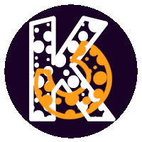

# Käpäläcraft - Luovuuden Nurkkaus README

Tervetuloa Käpäläcraftin Luovuuden Nurkkaukseen, seikkailuun elämän kirjavan kudoksen parissa!

Hei, olen Minna, iloinen käsillä tekemisen ja jutustelun ystävä. Tämä on minun pieni virtuaalinen nurkkaukseni, jossa jokainen päivä on täynnä mahdollisuuksia luovuuden ja ilon jakamisen suhteen, joka sai nimekseen Käpäläcraft.

## Kuka Minna On?

Käsillä tekeminen on minulle kuin sydämen juttu – se on intohimoni ja tapa ilmaista itseäni. Oli kyse sitten ompelusta, virkkauksesta, askartelusta tai koirien kanssa touhuamisesta, teen sen aina suurella sydämellä ja intohimolla. Elämässäni on enemmän vauhtia kuin tivolissa! Pienten lasten, työkiireiden ja uuden ammatin opiskelun keskellä yritän pysyä kiinni arjen seikkailuissa. Ja sitten on nämä ihastuttavat karvaiset kaverit, joiden kanssa jokainen metsälenkki on kuin satuun astuminen. Tule mukaan sekoittamaan pakkaa – rohkeasti viestiä tai jaa omia koirahurttailujasi!

## Mitä Täältä Löytyy?

Ompelu on minulle rakas harrastus, joka välillä kukoistaa ja välillä lepää hetken. Mutta suunnitelmat eivät lopu koskaan! Nelihenkisen perheen ja tilan puutteen haasteet eivät tukahduta luovuuden virtaa. Ja jos tämä ei olisi pelkkä tarina, niin näytetään myös suunnitelmia ja projekteja – ehkä saan ne joskus tasapainoon!

Virkkaus on vienyt minut mukanaan kuin virta, ja olen valmis uppoutumaan tähän uuteen maailmaan täysin. Vaikka saatan olla vähän hukassa virkkaustermeissä, koukkuni heiluvat ja langat liikkuvat – seuraavaksi koukusta voi pudota vaikka mitä!

Askartelu on minulle kuin seikkailu luovuuden maailmassa. Koruaskartelu, paperiaskartelu, makramee, miniatyyrit, ristipisto, tarrojen tekeminen ja vihkojen valmistus – täällä kohtaavat pienet ilot ja suuret luovat mahdollisuudet.

## JavaScript Carousel

Tässä projektissa käytän JavaScriptiä luomaan kuvakarusellin, joka pyörii automaattisesti ja reagoi hiiren liikkeisiin. Voit tutustua koodiin ja muokata sitä tarpeidesi mukaan.

## API Keyn Haku ja Datankeruu

Käytän myös JavaScriptiä hakemaan dataa Google Sheetsistä käyttämällä API-avainta. Voit nähdä, miten tämä toimii ja sovittaa sen omaan projektiisi tarpeidesi mukaan.

## Tule Mukana Seikkailuun!

Tervetuloa siis mukaan tutkimusmatkalle luovuuden kiehtovaan maailmaan! Toivottavasti löydät täältä inspiraatiota ja iloa omalle matkallesi. Muista, että yhdessä voimme tehdä tästä maailmasta hieman kauniimman paikan. Kiitos, että olet täällä mukana!

---

**Käpäläcraft - Luovuuden Nurkkaus README** © 2024 Minna. Kaikki oikeudet pidätetään.

